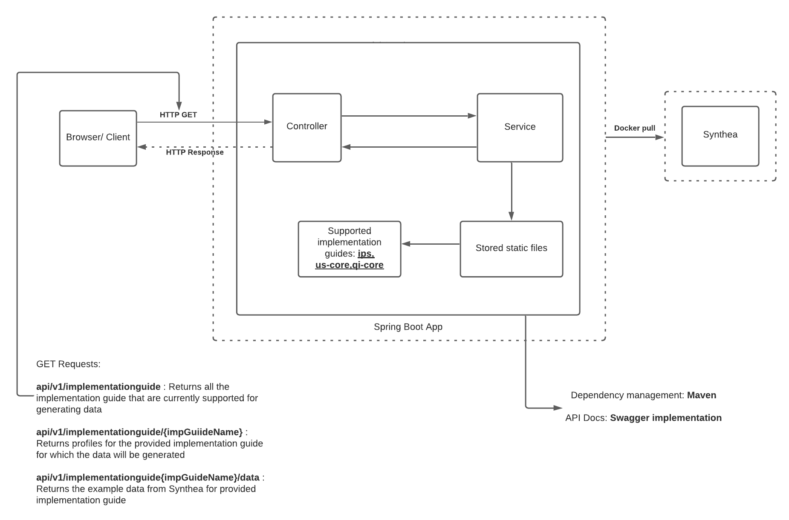

## FHIR Example with Spring Boot and PostgreSQL
## Prerequisites:
* Create the folder:
```
mkdir -p /var/lib/docker/volumes/synthea
```
* Clone synthea to this folder:
```
cd /var/lib/docker/volumes/synthea
git clone https://github.com/smart-on-fhir/synthea.git
```

## How it works:
### **1. Docker. First, you need to install docker**
* Download Docker [Here](https://docs.docker.com/docker-for-windows/install/). Hint: Enable Hyper-V feature on windows and restart;
* Then open powershell and check:
```bash
docker info
```
or check docker version
```bash
docker -v
```
or docker compose version
```bash
docker-compose -v
```
### **2. Spring boot app**
* Clone the repository:
```bash
git clone https://github.gatech.edu/nghimire3/FHIR-Example.git
```
* Build the maven project:
```bash
mvn clean install -DskipTests
```
* Running the containers:

This command will build the docker containers and start them.
```bash
docker-compose up -d
```

Appendix A.

All commands should be run from project root (where docker-compose.yml locates)

* If you have to want to see running containers. Checklist docker containers
```bash
docker container list -a
```
or
```bash
docker-compose ps
```

### **3. Architecture Diagram**

